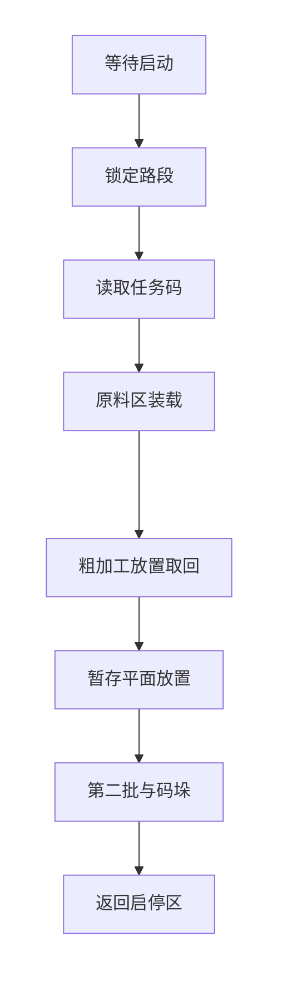
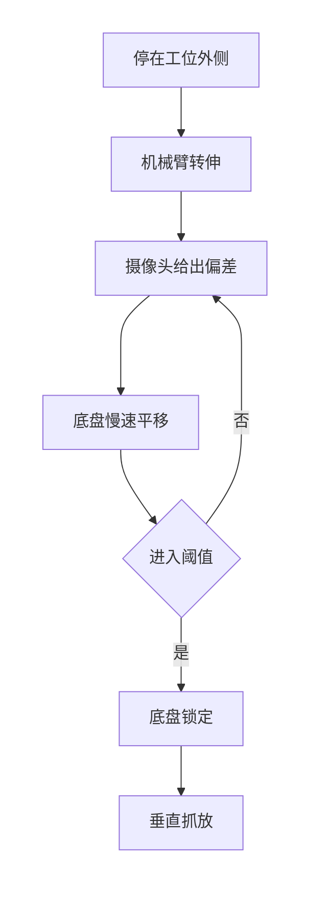
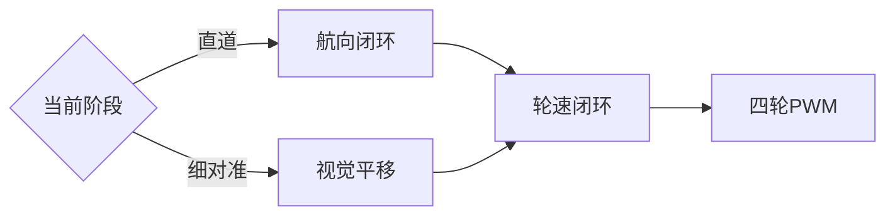

# 底盘路径规划、定位及速度控制方案

智能物流搬运赛项 ・ 电控设计稿  
轮径、轮距、各段航向与距离均不在本文写死，装车并对照场地图后再填入配置。

---

## 1. 设计目标

底盘在灰色车道内完成全场转运，并在原料区、粗加工区、暂存区为机械臂提供稳定的作业停车。放置圆环的重复精度优先于直道速度。

已确定的相关条件：

- 四轮麦克纳姆轮全向底盘。
- 车上为三角旋转托盘，机械臂只在直角顶点固定工位取放；换料由托盘旋转完成。
- 场地原料转盘由赛会提供，与车上托盘无关。
- 向下摄像头负责颜色与物料、圆环定位；侧视摄像头负责二维码与障碍。侧视辅助定位保留接口，暂时不启用。
- 避障为侧视摄像头加二维激光雷达，在离开启停区前扫描一次并锁定路段。

---

## 2. 坐标系与运动学

原点取底板几何中心，X 为前进方向，Y 为向左横移，Z 向上。车体指令为前进速度 vx、横移速度 vy、旋转角速度 ωz。

轮系采用 X 型镜像布置。四轮线速度（左前、右前、左后、右后）：

```
v1 =  vx - vy - ωz ・ (L + W)
v2 =  vx + vy + ωz ・ (L + W)
v3 =  vx + vy - ωz ・ (L + W)
v4 =  vx - vy + ωz ・ (L + W)
```

L、W 为轮心到原点的纵向、横向距离，D 为轮径，装车后实测写入配置。转速 n = v / (π ・ D) ・ 60。

vx、vy、ωz 分别限幅。若某轮超过最大转速，四轮按同一比例缩小，使实际运动方向与指令一致。航向以陀螺仪为准，编码器积分只作路程估计。

装车后的验收顺序：只给前进、只给横移、只给原地旋转。方向不对时先检查轮组安装与电机正反，再进入闭环调试。

---

## 3. 定位

中间十字灰色车道宽 400 mm，车道以外为白色或淡黄色。离开启停区后，车身铅垂投影不得进入这些浅色区域。场上没有供循迹的黑色引导线。

| 传感器 | 作用 | 使用阶段 |
|---|---|---|
| 陀螺仪 | 保持本段目标航向，抑制麦轮打滑造成的车头偏转 | 全程 |
| 编码器 | 轮速闭环；估计本段已走距离，用于接近工位时减速 | 全程 |
| 向下摄像头 | 物料与圆环中心偏差，换算为底盘微调 | 抓取与放置工位 |
| 侧视摄像头 | 读取二维码；在出发前扫描中确认视场内的黑色圆柱。辅助纠偏接口保留，第一版关闭 | 读码、出发前 |
| 激光雷达 | 出发前扫描一周，给出障碍相对车体的角度和距离 | 离开启停区之前，详见避障方案 |

行车阶段以航向闭环和路程估计为主。工位阶段切换为视觉偏差微调，到位后底盘速度为零。不用开环编码器脉冲完成圆环对准。

---

## 4. 路径规划

路径分为两层。

**任务层**按规则固定顺序推进，不随抽签改变。**路段层**只保存「从当前工位到下一工位」的目标航向和大致距离，进场对照地图标定，本文不给出具体角度和毫米数。抽签更换启停区时更换路段表，任务顺序不变。路线按已经锁定的路段表执行。



扫描若对不上路段表，就停在启停区，不进入后面的工序。每个工位内部再走下面的对准流程。



### 4.1 工位

| 代号 | 含义 | 停车要求 |
|---|---|---|
| HOME | 抽签确定的启停区 | 整车停在区内 |
| QR | 竖直二维码板 | 侧视能够读取，车身位置符合车道规则 |
| RAW | 赛会电动转盘 | 车身在车道内，机械臂能够到达转盘 |
| ROUGH | 粗加工区圆环 | 车身在车道内，机械臂能够到达指定环 |
| TEMP | 暂存区圆环 | 同上；第二批在此码垛 |

### 4.2 可复用的底盘动作

| 动作 | 内容 |
|---|---|
| 保持航向 | 速度为零，航向闭环 |
| 车道行驶 | 沿本段目标航向行驶，按编码器估计减速。不使用灰度传感器做横向修正 |
| 转向 | 低速转到下一段航向 |
| 爬行接近 | 进入工位前降速，停在机械臂能够粗对准的位置 |
| 视觉对接 | 机械臂保持粗对准姿态后，按向下摄像头偏差做小幅平移，进入阈值后停车 |
| 锁定 | 前进与横移为零，供机械臂和托盘动作 |

### 4.3 任务状态

N 为一次装载件数，默认 3，配置可改为 1。颜色与环号来自任务码，不在程序中写死。

1. **等待启动**  
   停在抽签启停区，等待一次启动。

2. **出发前扫描**  
   仍停在启停区，底盘速度为零。激光雷达与侧视确认被堵住的车道，并锁定对应路段。结果对不上路段表时留在启停区，不进入车道。

3. **进入车道**  
   按锁定路段离开启停区，进入灰色车道。

4. **读取任务码**  
   行驶至二维码板，由侧视摄像头读取并在车载屏幕显示。解析两批物料的颜色顺序和放置环号。读取失败时只做小幅调整并重试，超时后停车，不进入抓取。

5. **前往原料区**  
   按路段表行驶，停在转盘外侧。

6. **装载一批物料**（第一批、第二批各执行一次）  
   对第 i 个物料（i = 1…N）：
   - 将空托盘转到直角顶点，底盘锁定；
   - 机械臂升到安全高度，回转到原料工位并伸到接近半径，此为粗对准，期间底盘锁定；
   - 等待场地转盘把目标颜色送到可抓取位置；
   - 机械臂保持该姿态，底盘按视觉偏差慢速平移，进入阈值后锁定；
   - 机械臂垂直抓取并放入车上托盘，期间底盘保持锁定。  
   N 个全部上车后才允许离开原料区。

7. **前往粗加工区**  
   车上载有物料时降低加速度。

8. **粗加工区放置并取回**  
   对第 i 个物料：
   - 将对应颜色的托盘转到直角顶点，底盘锁定；
   - 从固定工位夹起，升到安全高度；
   - 回转并外伸到粗加工工位，完成粗对准；
   - 机械臂保持姿态，底盘对指定圆环做细对准，完成后锁定；
   - 垂直放置，该物料标记为已放置，不再产生推移动作；
   - 按任务顺序从圆环取回，放回车上托盘。

9. **前往暂存区并平面放置**（仅第一批）  
   对环与放置方式同粗加工区。放置完成后不再取回。

10. **第二批**  
   返回原料区，按任务码第三段重复装载；再到粗加工区，按任务码第四段重复放置并取回。

11. **暂存区码垛**（仅第二批）  
    目标为第一批同色物料的中心。对接后垂直放下，下降高度增加一个物料高度。

12. **返回启停区**  
    回到抽签确定的启停区，显示抓取数量和放置数量。

等待场地转盘单独作为状态，与故障停车区分。机械臂做粗对准、升降、开合或托盘旋转时，底盘速度为零。细对准时机械臂保持姿态，底盘只做慢速平移。障碍在离开启停区前锁定路段，行驶中不改路线，也不贴着障碍横移。

---

## 5. 速度控制

直道和工位使用不同的闭环。直道靠航向和轮速，细对准才打开视觉层。本方案不使用灰度传感器。



控制由内到外为三层：

1. 四轮转速闭环：编码器测速，输出各电机 PWM。  
2. 航向闭环：陀螺仪与目标航向的偏差输出 ωz。  
3. 视觉位置闭环：仅在对接物料和对接圆环时，把像素偏差转为小幅 vx、vy。

直道为中速。距工位约 150 mm 起改为爬行。圆环对接使用更低的速度，进入阈值后锁定，再由机械臂垂直下降。对接圆环是放置精度所在：1 环外径为物料最大直径加 3 mm，且物料底面接触台面后不得再移动，因此这段不与直道共用同一速度。

路程采用先加速、再匀速、再减速的速度曲线。控制周期：轮速闭环 1～5 ms，航向闭环 5～10 ms，任务状态 10～20 ms。视觉数据在串口接收中处理。

调试顺序：单轮转速，航向直行，车道行驶，最后视觉对接。参数装车后写入配置，本文不预设具体系数。

---

## 6. 与其他部分的接口

- 机械臂、托盘未结束动作时，底盘保持锁定。
- 向下摄像头只在对接状态被采用。
- 侧视摄像头向底盘提供任务码和障碍；辅助定位字段保留且默认无效。
- 激光雷达与避障逻辑见避障方案。扫描在离开启停区之前完成，行驶中不因避障改线。
- 显示任务码、抓取数、放置数由电控在对应状态刷新。

---

## 7. 计划书正文

本车采用四轮麦克纳姆轮，以前进、横移和旋转为控制量，经逆运动学分配至四轮，超速时同比缩放以保持运动方向。直道行驶以陀螺仪保持航向、编码器估计路程，车身保持在灰色车道内。不使用灰度传感器。工位对准使用向下摄像头，在低速下将物料或圆环中心偏差收敛后再锁定底盘，随后由机械臂垂直放置。一键启动后先在启停区内锁定被堵住的车道，再按路段表读取二维码、装载、放置、码垛并返回同一启停区。各段航向与距离对照场地图标定。工位上先由机械臂完成粗对准，再由底盘做视觉细对准。机械臂粗对准、升降和托盘旋转期间底盘速度为零。侧视摄像头用于读码，并在出发前确认视场内的障碍。
