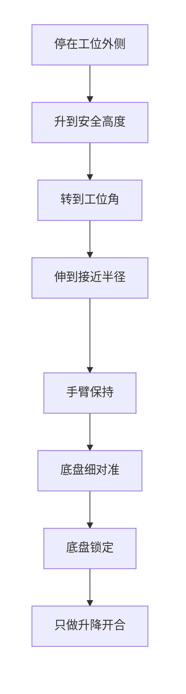
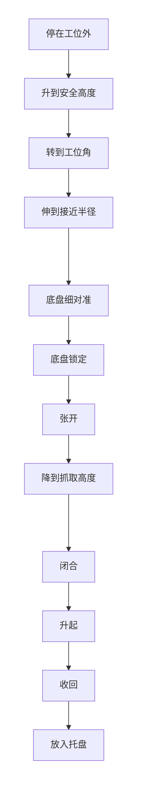
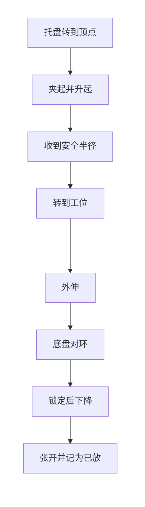

# 机械臂控制方案（初步）

智能物流搬运赛项 ・ 电控设计稿  
状态：初步方案。尚未装车、尚未写入车上程序。步距、链传动当量、舵机脉宽、各工位角度和高度依赖实机测量，本文不写死。

结构按本次说明：二倍程升降，两根纵向支架约束夹爪上下运动；夹爪装在横向支架上，齿轮链条实现前后伸缩；三层环形爪由上而下直径增大，相对竖直线倾斜，开合由一只舵机完成。回转使用 42 步进电机，伸缩使用 28 步进电机，升降使用 35 步进电机。

车上三角托盘仍由单独的舵机旋转，不属于这四只执行器。机械臂只在直角顶点取放。

---

## 1. 控制思路

三个步进轴是柱坐标，软件不做多关节逆解。

- 回转步进给出绕竖直轴的角度 θ。
- 伸缩步进通过齿轮链条给出沿臂伸出方向的位移，记为径向位置 r。
- 升降步进带动二倍程，末端竖直位移按主动件的 2 倍计算。两根纵支架只约束方向。
- 三层爪的直径和倾角是被动几何。舵机只做开、合两个位置。

软件中的目标是「θ、r、末端高度 z、爪开或合」。毫米和角度在一处换成脉冲。

粗对准和细对准分开，细对准不再转动机械臂。

粗对准把夹爪送到工位附近：底盘沿路段停到工位外侧，机械臂升到安全高度，回转到该工位角度，再伸到接近半径。这三步使用标定值，此时不看视觉偏差。

粗对准结束时，回转和伸缩保持不动，摄像头与夹爪的相对位置也就固定下来。剩下的偏差交给底盘，按向下摄像头的像素偏差做慢速平移，直到收进阈值，然后底盘锁定，机械臂只做垂直升降。这一段与底盘方案中的视觉对接一致。

细对准若再转动机械臂，臂上摄像头会绕回转轴移动，画面里的目标位置跟着变，效果与微调底盘相同，都是在改摄像头和目标的相对位置。因此细对准只移动底盘，不叠加回转或伸缩。底盘也不是到站后就一直锁定：机械臂在回转、伸缩、升降、开合时底盘速度为零；细对准的那一段底盘允许慢速移动。



前三步是粗对准，使用标定值。从「保持」开始，机械臂不再为了对准而转动。

步进没有编码器，位置只信任相对归零开关的步数。链条有间隙，粗对准的外伸从收回一侧单方向接近。

行车前手臂处于收拢姿态：伸缩收回，回转到停放角，升降停在整车高度允许的位置。出发投影不大于 300 mm × 300 mm、高度不大于 400 mm。

---

## 2. 四个执行器

| 轴 | 执行器 | 软件量 | 位置从哪里来 |
|---|---|---|---|
| 回转 | 42 步进 | θ | 归零开关起的步数 |
| 升降 | 35 步进 | z 末端 | 主动件步数，末端 = 2 × 主动件位移 |
| 伸缩 | 28 步进，齿轮链条 | r | 归零开关起的步数，按链传动当量换算 |
| 开合 | 舵机 | 开或合 | 两档脉宽；无反馈，靠保持时间 |

三只步进均按 1.8° 整步、一圈 200 步计入换算。驱动器细分在型号确定后写入配置。主控输出 DIR、STEP、ENABLE。带料和悬臂时保持使能，避免被自重拖离步数。

升降的 2 倍按机构传动比使用。装车后测量主动件行程和末端实际升高，若比值不同，只改这一个系数。伸缩的毫米当量、回转的每度步数同样装车实测后填写。

---

## 3. 坐标

原点在机械臂回转轴上。θ = 0 为归零开关处的方向，r = 0 为伸缩收到归零开关，z = 0 为升降归零时的末端高度，向上为正。

```
z = z_home + 2 ・ s_lift
r = r_home + s_ext
θ = θ_home + s_rot
```

直角顶点取放姿态记为 `(θ_tray, r_tray)`，各场地工位另有一组粗对准用的 `(θ_work, r_work)`，全部标定。

细对准不把像素偏差换成 Δθ 或 Δr。向下摄像头给出的像素偏差，按底盘方案换成车体方向的慢速 vx、vy。此时 θ、r 保持粗对准结束时的值。偏差进入阈值后 vx、vy 归零，底盘锁定，再只动升降。放环阈值比抓取更严，数值装车后填写。

---

## 4. 运动顺序

- 回转之前，伸缩在安全半径以内，升降在安全高度以上。这两段底盘速度为零。
- 外伸只在回转已经到达该工位角度之后进行。外伸期间底盘速度为零。
- 外伸结束后进入细对准，只允许底盘慢速平移，机械臂三轴脉冲停止。
- 细对准完成并锁定底盘之后，才下降。下降过程中 r、θ 和底盘都保持不动。
- 上升离开台面或托盘之后，才允许收回和回转。
- 托盘只在手臂离开直角顶点上方之后旋转。

速度使用梯形曲线。放环和插入托盘的最后一段用单独的低速。物料底面接触台面并完成松爪后，该件记为已放置，不再产生平移。

### 4.1 从场地抓取并放入车上托盘



抓取高度按转盘顶面加上物料高度标定。转盘总高在 80�C100 mm 之间，正式数值现场测量后写入。从外伸到锁定之前，底盘处于细对准；锁定之后直到手臂重新收拢，底盘速度为零。

### 4.2 从托盘取出并放入圆环



松爪后先升到离开台面，再收回。

### 4.3 码垛

路径与放入圆环相同。下降目标为平面放置高度再加上一件物料的高度。对准点是已经放好的同色物料中心。松爪后先上升。

### 4.4 行车收拢

底盘允许起步的条件是：伸缩在收拢半径内，回转在停放角，升降在行车高度，三轴脉冲已经发完。任一轴还在运动，底盘速度保持为零。

---

## 5. 步进和舵机怎么驱动

主控为 STM32F407。三个步进共用一个节拍定时器，需要走步时翻转 STEP。DIR 在该段第一步之前写好。步间隔按梯形曲线变化。最高步频以电机不丢步为准，装车后确定。

每轴一个归零开关。上电顺序为先收回伸缩，再回转找开关，最后升降找开关。开关在最大步数内没有出现，三轴停住，不进入比赛流程。调试阶段完成归零并保持驱动器通电。一键启动后不做大范围归零。中途断电则步数作废，需重新归零。

舵机用定时器 PWM，只有张开、闭合两档。同一次比赛的三种颜色为同一种形状，共用一档闭合脉宽。发出闭合指令后保持一段标定时间，再允许上升。三层爪由这一只舵机一起开合，张开脉宽要让最大一层能避开物料。脉宽和保持时间装车后填写。

---

## 6. 和底盘、视觉、托盘的接口

- 机械臂回转、伸缩、升降、开合期间，底盘速度为零。
- 粗对准完成后，细对准只使用底盘慢速 vx、vy。此期间机械臂步数保持不变。
- 细对准结束后底盘锁定，然后才升降。
- 向下摄像头只在细对准时使用。回转、伸缩和升降过程中的画面丢掉。
- 托盘舵机只在手臂离开直角顶点后转动。取放点只有直角顶点一处。
- 高度和工位角来自标定表，按任务码选择第几件、几号环，不在运动中重算路径。

---

## 7. 装车后填写的参数

下列项目依赖实机，当前不填数，也不影响上面的分工。测量结果直接写入配置。

- 升降主动件的实际传动比，设计值按 2 使用。
- 伸缩每毫米步数、回转每度步数、驱动器细分。
- 三个归零开关所在的一端，以及收拢角。
- 舵机张开、闭合脉宽和闭合保持时间。
- 各工位的 θ、r、抓取高度、放环高度、一件物料的高度。
- 细对准的抓取阈值和放环阈值。
- 下降时爪体是否遮挡向下摄像头。若遮挡，细对准时爪保持张开，下降过程不再使用该画面。

---

## 8. 计划书正文（写入 Word）

机械臂由回转、伸缩、升降和夹爪开合四个动作组成。回转使用 42 步进电机，伸缩使用 28 步进电机，升降使用 35 步进电机，夹爪开合使用舵机。升降为二倍程，末端位移按主动件的 2 倍计算；两根纵向支架约束升降方向。夹爪为三层环形爪，由上而下直径增大，由一只舵机联动开合。车上取放只在三角托盘的直角顶点进行。粗对准时，底盘停在工位外侧，机械臂回转到工位角度并伸到接近半径。此后机械臂保持该姿态，剩余偏差由底盘根据向下摄像头慢速平移完成细对准，再锁定底盘，机械臂垂直升降完成抓取或放置。放入圆环时低速下降，松爪后升起，不再推移该物料。机械臂动作期间底盘速度为零。行车前手臂收回至出发尺寸允许的姿态。步进位置以归零开关为基准，步距与舵机脉宽装车后标定。
