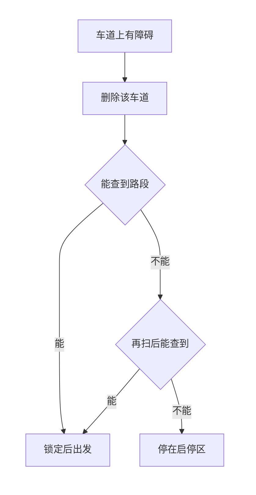
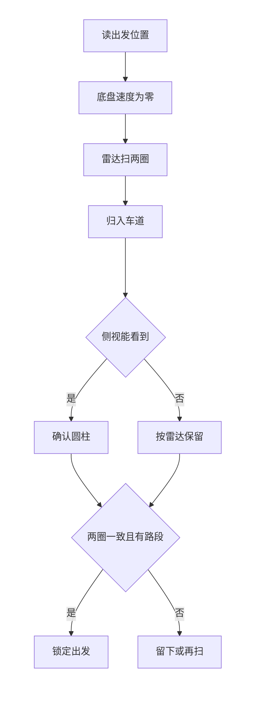

# 避障控制决策方案

智能物流搬运赛项 ・ 电控设计稿  
状态：理论方案。雷达型号、扫描面高度、各车道区域和遮挡角均不在本文写死，装车并对照场地图后写入配置。

---

## 1. 设计前提

离开启停区后，底盘只在灰色车道上行驶，不进入白色或淡黄色区域。中间为十字灰色车道，宽 400 mm。

黑色圆柱障碍的尺寸为直径 50 mm、高 100 mm。障碍会出现在哪些车道，当前还不能确定。障碍在车道中部时，两侧空档不足以让车身留在灰道内绕过，因此不贴障通过。某条车道上出现障碍，该车道从本次地图中删除。

蓝色启停区有两处，抽签决定出发位置，返回同一处。车道数量有限，因此堵死组合的总数有限，但当前不能确定具体有几种，本文不列出组合编号。路段表按「出发位置 + 被堵车道」在车道确定后填写，一次运行只锁定一套。任务顺序不变，路段航向和距离在标定后填写。

感知为侧视 K230 加二维激光雷达。一键启动后、底盘仍在蓝色启停区内完成一次扫描，然后锁定路线。



车身不从障碍旁边挤过。锁定之后，行驶中不再更换路段。

---

## 2. 可行性

这个扫法可以用来锁定路线。它成立的范围是：发令时障碍已经立在车道上，并且雷达从该启停区能直接打到它们。

**扫描时车身不动。** 出发投影不大于 300 mm × 300 mm，启停区也是 300 mm × 300 mm。车身接近这个尺寸时，原地转向会把车角带出蓝区。扫描期间 vx、vy、ωz 都保持为 0。四周距离由雷达自身旋转一周得到，不靠底盘转向。

**扫描面落在圆柱中下部。** 圆柱只有 100 mm 高，扫描面高于此就打空。原料转盘高 80�C100 mm、直径 300 mm，粗加工台和暂存台的台体同样会挡住扫描面后方的空间。被挡住的方向没有回波，记为未看到，不记为该方向可通行。转盘和二维码板的位置在规定范围内变化，两种出发位置的遮挡角分开标定。

**50 mm 的短弦和场地装置可以分开。** 距离 1.5 m 时，直径 50 mm 的圆柱张角约 1.9°；距离 2 m 时约 1.4°。所选雷达在最远标定距离上，对这个圆柱至少给出 2 个回波，弦长才稳定。转盘的可见弦长在 300 mm 量级，台面边为 150 mm 与 580 mm，二维码板为竖立 A4，这些回波不作为删车道的依据。雷达装在车内，出发时整车仍在 300 mm × 300 mm × 400 mm 以内。雷达只测距，不照亮场地。

**摄像头确认视场内的候选，不负责看全四周。** 侧视固定在车上，停车时只有一个视场。雷达候选落在该视场内时，再用黑色直立圆柱的外形确认，两者一致才把该点所在车道记为堵住。候选在视场外时，用雷达弦长、所在车道区域，以及离开台面屏蔽区这三条一起判定，并要求连续两圈落到同一条车道。台面角点也可能呈现接近 50 mm 的短弦，所以短弦还必须落在车道的标定区域内、并位于台面屏蔽区之外。

**使用前提。** 命题写明障碍的数量和位置由抽签放置，没有写摆上的时刻，也没有写一定会落在哪几条车道。本方案按「开始扫描时障碍已经在车道上」实施。若现场在车辆离开启停区之后才摆障碍，这次扫描无效。

**扫不清就留在启停区。** 被堵车道都能归入已有路段表时，才锁定路段并出发。否则在启停区内再扫一圈。第二圈仍不能对应，就停在启停区，不进入未确认的车道。

---

## 3. 地图与路线表

车道在标定场地图时编号。车道名字、工位属于哪条车道、每种出发位置下雷达坐标到场地坐标的变换，都在那时确定。当前不规定障碍一定出现在哪几条车道，也不规定一次有几处。

查表键为「出发位置 + 被堵车道的集合」。某种堵法若使某一工位无法沿剩余车道到达，该组合标为不可用，车留在启停区。组合总数有限，具体几种在车道确定后写入，本文不列表。

任务顺序仍为：读取二维码，原料区装载，粗加工区放置并取回，暂存区平面放置，第二批装载、放置并取回，暂存区码垛，返回本次启停区。

---

## 4. 一次扫描如何归入车道

雷达输出一圈的角度和距离。相邻点角度间断超过标定间隙，或距离突变，就分成不同的簇。一簇两端点的弦长为

```
d = sqrt(r1^2 + r2^2 - 2 * r1 * r2 * cos(dθ))
```

弦长落在圆柱标定区间内的簇作为候选。簇的代表点取平均距离和平均角度，再变到场地坐标：

```
x = r * cos(θ + θ_mount)
y = r * sin(θ + θ_mount)
X = x0 + x * cos(yaw0) - y * sin(yaw0)
Y = y0 + x * sin(yaw0) + y * cos(yaw0)
```

`θ_mount` 是雷达零位相对车头的安装角。`(x0, y0, yaw0)` 是该出发位置在场地中的标定位姿。点落在哪条车道的标定长条内，就归到哪条车道。落在转盘、两处台面或二维码板屏蔽区内的簇丢弃。

落在侧视视场内的候选，交给侧视做黑色圆柱外形判定，判定方法与软件方案中的侧视一致。外形不符则该簇丢弃。

连续两圈归入的车道相同，才进入锁定。



---

## 5. 行驶中的约束

锁定之后按该路段的航向行驶，陀螺仪保持航向，编码器估计路程。对接物料、对接圆环、机械臂动作和托盘旋转期间底盘锁定。

行驶中若测到的通断与已锁定结果矛盾，停车，留在灰色车道内。不改为贴障通过，也不进入黄区或白区，不在行驶中更换路段。

---

## 6. 计划书正文（写入 Word）

障碍出现在某条车道上，则该车道从本次路线中删除，车身不从障碍旁边挤过。车道数量有限，堵死组合的总数有限，具体有几种在场地确定后写入路段表。一键启动后车辆停在蓝色启停区内，二维激光雷达扫描一周，按约 50 mm 的弦长和标定区域判断被堵车道，侧视摄像头确认视场内的黑色圆柱。连续两圈结果一致且能对应已有路段后锁定，再离开启停区，本轮不再改变。扫描面低于圆柱高度，被转盘或台面挡住的方向记为未看到。结果对不上路段表时，车辆留在启停区。其后底盘只在灰色车道内按锁定路段行驶，对接与机械臂动作期间不因避障转向。
