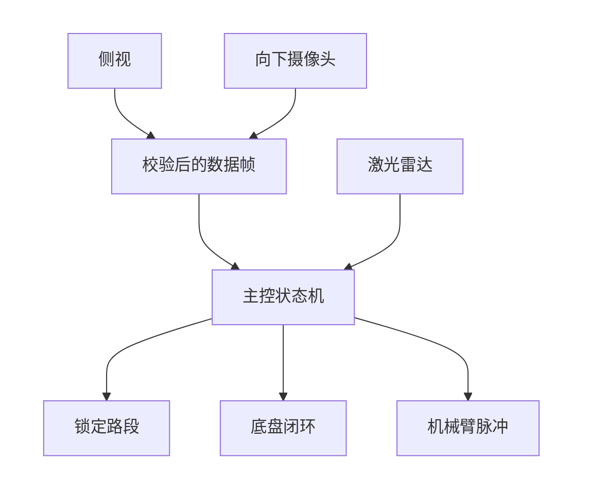
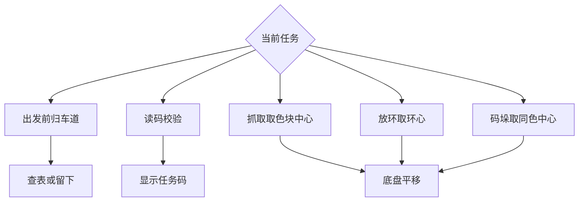

# 软件算法设计总结

智能物流搬运赛项 ・ 电控  
对应计划书第 9 节。下文只列本项目会用到的算法。尚未装车。本方案不使用灰度传感器，也不做灰度巡线。

图像算法在两路 K230 上运行。STM32F407 做状态机、底盘闭环、雷达归车道和机械臂脉冲，只接收带校验的视觉结果。

校验失败或当前用不到的帧直接丢掉。侧视负责任务码和黑色圆柱，向下摄像头只在细对准时给出颜色和中心。

---

## 1. 路径

**任务状态机。** 顺序固定为读码、装载、粗加工、暂存、第二批、码垛、返回本次启停区。出发位置和障碍只改变所走路段，不改变这个顺序。

**路段查表。** 障碍所在车道视为堵死。车道数有限，堵法总数有限，具体几种等场地确定后再写入。查表键是「出发位置 + 被堵车道」。出发前锁定一套，行驶中不重新规划。结果对不上表，或中途与锁定结果矛盾，就停在灰色车道内。

## 2. 底盘

**麦轮逆解与限幅。** 由前进、横移、旋转求出四轮速度。某一轮超过最大转速时，四轮乘同一比例缩小。

**梯形速度。** 路段行程按加速、匀速、减速行驶。靠近工位改为爬行，放环时再降低速度。

**分层闭环。** 由内到外三层：轮速按编码器偏差调节 PWM；航向按陀螺仪偏差调节旋转；细对准时按向下摄像头的像素偏差调节慢速平移，进入阈值后底盘锁定。没有灰度边界这一层。

## 3. 障碍与视觉

**雷达归车道。** 一圈扫描按角度和距离断点分成点簇，用簇两端的弦长区分直径约 50 mm 的圆柱与转盘、台面。代表点变到场地坐标后，落入某条车道的标定区域即记该车道被堵。转盘和台面的屏蔽区内的点丢掉。看不到的方向记为未看到，不记为通路。连续两圈一致才锁定。

**黑色圆柱外形。** 侧视在视场内做低亮度掩膜，保留面积和长宽比符合直立圆柱的轮廓，用来确认雷达候选。视场外的候选只按雷达规则处理。

**任务码校验。** 侧视读取二维码后，检查是否为四组三位数、数字均在 1 到 6、组间用加号连接。连续两帧相同才采用。1 到 6 对应红、黄、蓝、绿、黑、浅蓝。

**物料颜色与中心。** 向下摄像头对六种颜色做阈值分割，取夹持点附近最大的实心色块。蓝色和浅蓝重叠时用亮度分开。中心用轮廓矩，再减去夹持点像素。

**圆环中心。** 放置前对台面边缘做椭圆拟合，把圆心聚在一起的同心椭圆取平均，作为环心。码垛时改为同色物料的色块中心。

**细对准换算。** 像素偏差只在机械臂已经完成粗对准、回转和伸缩保持不动时使用，换成底盘的慢速平移。机械臂运动过程中的画面丢掉。

**串口校验。** 视觉结果以固定帧头加异或校验上传。校验失败、长度不对，或当前状态不需要视觉时，整帧丢弃。

## 4. 机械臂

**柱坐标脉冲。** 回转、伸缩、升降分别对应角度、半径和高度，目标统一换成步进脉冲。升降末端位移按主动件的 2 倍计算。三只电机为回转 42 步进、伸缩 28 步进、升降 35 步进，开合为舵机。

**梯形步进与归零。** 脉冲间隔按梯形曲线变化。每轴以归零开关为步数零点，上电时先收回伸缩，再回转，最后升降。

**开合时序。** 舵机只有张开、闭合两档。闭合指令发出后保持一段标定时间，才允许上升。

**动作互锁。** 回转前伸缩必须收回、升降必须到安全高度。外伸之后才进入底盘细对准。细对准结束并锁定底盘后，才允许垂直升降。手臂未离开托盘直角顶点时，托盘不旋转。

---

## 5. 计划书正文（写入 Word）

软件算法分为路径、底盘、视觉和机械臂四部分。图像处理在两路 K230 上完成，主控只接收带校验的结果。路径使用状态机查表：障碍堵住的车道被删除，出发前锁定一套路段，行驶中不重新规划。底盘采用麦轮逆解，并以轮速、航向和工位视觉分层闭环，细对准时把像素偏差转为慢速平移。障碍由雷达点簇的弦长归入车道，侧视确认黑色圆柱；向下摄像头用颜色阈值和轮廓中心定位物料与圆环。机械臂按柱坐标生成步进脉冲，升降按二倍程换算，对准后只做垂直运动。
