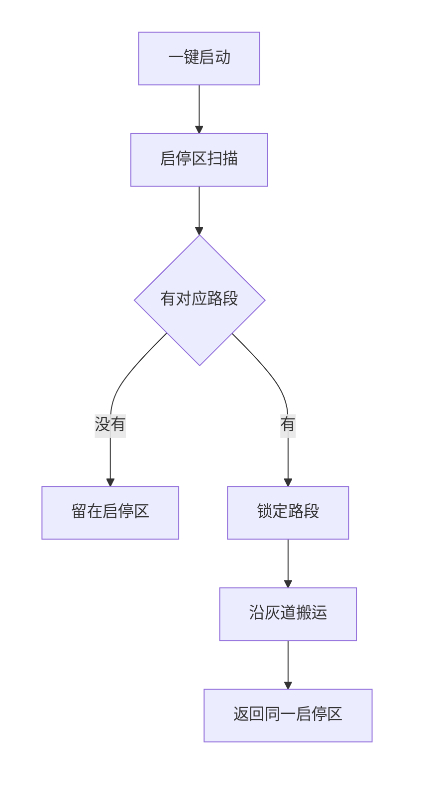
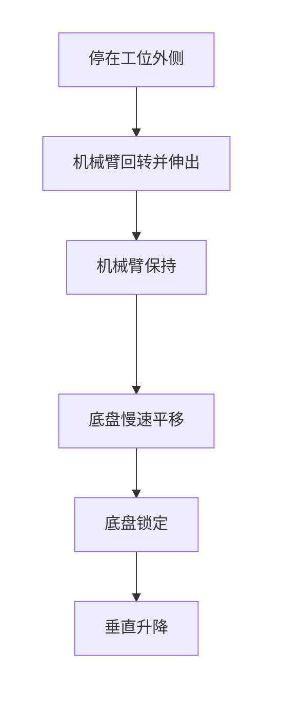

# 电控关键技术与创新点

智能物流搬运赛项 ・ 电控说明  
依据目前已讨论的底盘、机械臂、避障和软件方案。尚未装车。雷达型号、步进当量仍待实机填写，下面不把这些写成已经完成的技术。本方案不使用灰度传感器。

一次运行只锁定一套路段。锁定之后按任务顺序走完，中途不再改路。

粗对准使用标定角度和伸出量。细对准只移动底盘，放下之后不再推移物料。

---

## 1. 关键技术

电控集中在 STM32F407 上，用定时器和主循环分工，不把图像放进主控。

**底盘运动。** 四轮麦克纳姆轮以前进、横移、旋转为控制量，逆解到四轮；某轮超速时四轮同比缩小，避免方向被拉偏。闭环由内到外是轮速、航向和工位视觉。直道靠陀螺仪保持航向、编码器估计路程。不使用灰度传感器。

**任务与路线。** 任务顺序固定：读码、装载、粗加工、暂存、第二批、码垛、回到本次出发的启停区。障碍落在某条车道上，该车道即被堵死。车道数量有限，所以堵法的总数有限，但当前还不能确定具体有几种。路段表按实际堵法预先写好，启动后锁定一套，行驶中不重新计算。

**视觉。** 两路 K230 分开使用。侧视读二维码，并在出发前确认视场内的黑色圆柱。向下摄像头只在细对准时给出颜色，以及物料中心或圆环中心相对夹持点的像素偏差。结果打成带校验的串口帧，校验失败的帧丢掉。

**避障感知。** 二维激光雷达在车身不动时扫描一周，用约 50 mm 的弦长判断目标落在哪条车道。侧视只辅助确认自己看得到的候选。转盘和台面挡住的方向记为未看到。

**机械臂。** 回转用 42 步进，伸缩用 28 步进，升降用 35 步进，开合用舵机。三轴按柱坐标控制，升降按二倍程把末端位移算成主动件的 2 倍。位置以归零开关为起点的步数。粗对准用标定角度和伸出量，细对准不再转动手臂。

**安全互锁。** 机械臂动作和托盘旋转时底盘速度为零。细对准结束后才垂直下降。物料接触台面并松爪后，不再推移该件。显示任务码、抓取数和放置数，字符高度不小于 12 mm。

---

## 2. 创新点

**用有限路段表代替行驶中的重新规划。** 障碍出现在某条车道上，就把该车道堵死，只走剩余车道。车道数有限，堵法总数也就有限；具体有几种要等场地车道确定后再填进路段表，当前不写死组合编号。一次运行在出发前锁定与本次堵法对应的那一套，任务顺序不变。结果对不上已有路段，或行驶中与锁定结果矛盾，就停在灰色车道内，不临时改道。

**出发前静止扫描，而不是开到路口再看。** 启停区与出发投影都是 300 mm × 300 mm，原地转向会把车角带出蓝区。雷达自己转一周完成四周测距，底盘速度保持为零。摄像头视场盖不住四周，所以由雷达判断哪条车道被堵，摄像头只确认视场内的黑色圆柱。没有回波不当成通路。判别结果对不上已有路段，就留在启停区。

**被堵住的车道直接删除，不从障碍旁边挤过。** 灰色车道宽 400 mm。障碍位于车道中部时，两侧剩余宽度不足以让车身留在灰道内通过。电控因此不做贴障横移，只在剩余车道上选择已经写好的路段。障碍具体会出现在哪些车道，当前不作规定。

**粗对准和细对准分开，细对准时手臂不动。** 底盘先停在工位外侧，机械臂回转到工位角度并伸到接近半径，摄像头和夹爪的相对位置随之固定。剩余偏差只由底盘按向下摄像头慢速平移消除。细对准若再转手臂，摄像头会跟着动，和挪底盘一样都在改画面，所以这一段不叠加回转或伸缩。对准后锁定底盘，手臂垂直升降。1 环只有很小的径向余量，而且接触台面后不能再推，所以放环用更低的速度，并在松爪后直接升起。

**灰色车道上不循黑线。** 行驶方向靠陀螺仪，路程靠编码器，工位毫米级偏差靠向下视觉。这样直道速度和放环精度可以分开，不会用同一套循迹速度去对圆环。

**机械臂按柱坐标和二倍程控制。** 回转、伸缩、升降分别对应角度、半径和高度，主控不做多关节逆解。二倍程只改末端与主动件的比例。三层环形爪由一只舵机开合，直径和倾角不单独控制。取放点只有车上托盘的直角顶点，换料靠托盘旋转。

---

## 3. 计划书正文（写入 Word）

电控的创新点集中在路径选择和放置精度。障碍落在某条车道上则该车道堵死，各种堵法数量有限，出发前由激光雷达与侧视一次判别并锁定对应路段，行驶中不再改线，也不贴障通过。机械臂完成粗对准后保持姿态，底盘再按向下摄像头消除剩余偏差，锁定后垂直放下，使物料对准圆环且放下后不再推移。
